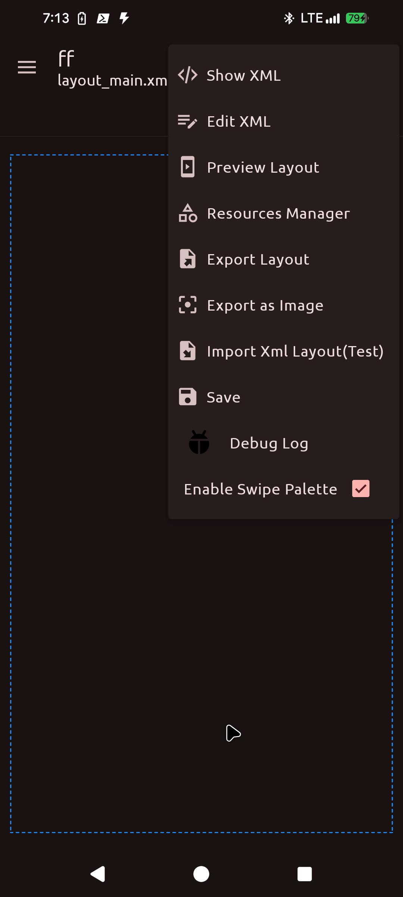
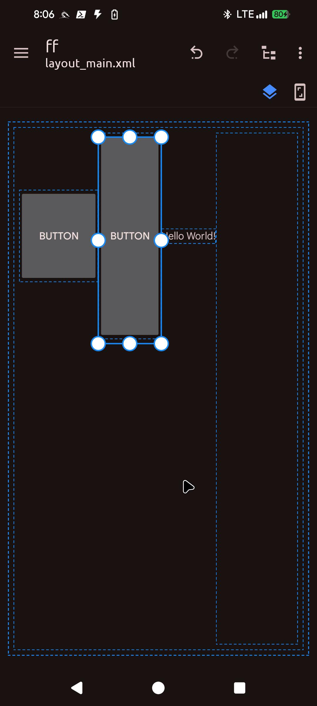
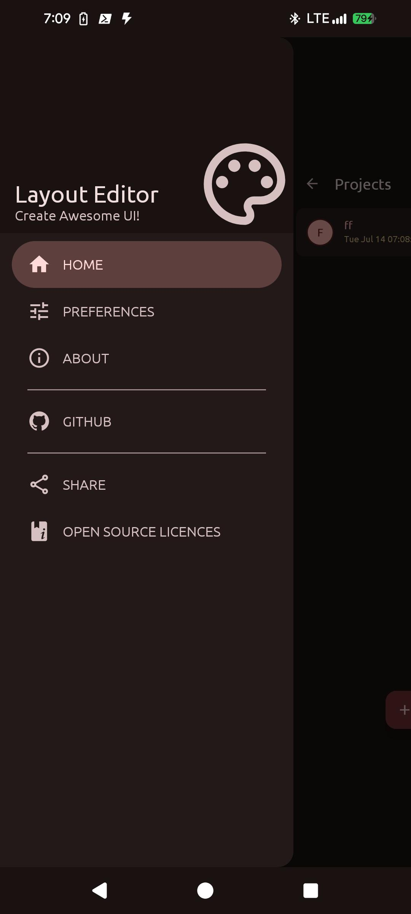
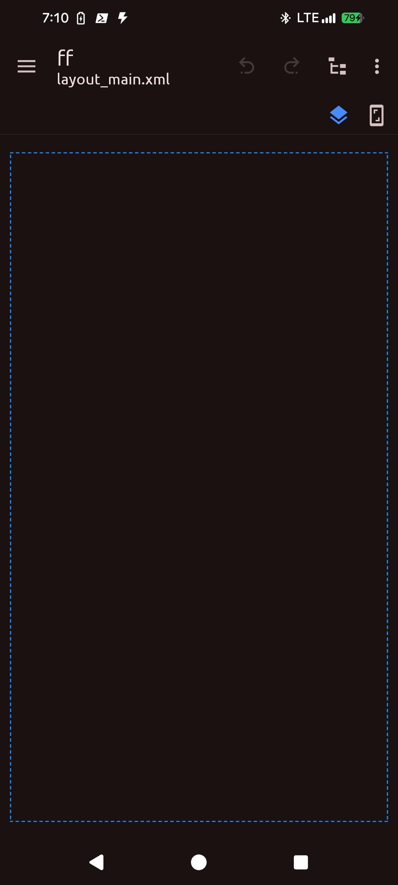
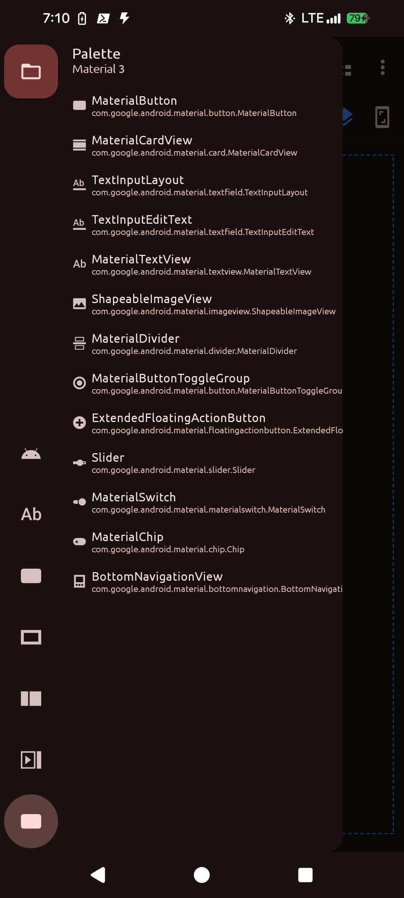

<div align="center">

[](https://github.com/Genta-ta/layouteditor/releases/latest)
[](https://discord.gg/EdeVQSghMA)


[](https://github.com/Genta-ta/layouteditor/blob/main/LICENSE)

</div>

**Layout Editor** is an Android app that lets you visually design UI layouts by dragging and dropping widgets onto a design canvas. Build Android layouts on your phone - no computer needed.

## Features

### Visual Editor
- **Drag & Drop** - Drag widgets from the palette onto the canvas to build layouts
- **WYSIWYG Editing** - See your layout as it will appear on a real device
- **Blueprint Mode** - Switch to wireframe view for structural clarity
- **Resize Handles** - Select any view and resize it using 8 interactive handles (corners + edges)
- **View Selection** - Tap to select, tap empty area to deselect
- **Layout Transitions** - Smooth animations when adding/removing child views

### Widget Palettes
- **75+ widgets** organized into 7 categories:

| Category | Widgets |
|----------|---------|
| **Common** | LinearLayout, ScrollView, TextView, Button, ImageView, Switch, RecyclerView |
| **Text** | TextView, EditText (Plain, Password, Email, Phone, Date, Time, Number, etc.), AutoComplete, CheckedTextView |
| **Buttons** | Button, ImageButton, Chip, ChipGroup, CheckBox, RadioButton, RadioGroup, ToggleButton, Switch, FAB |
| **Widgets** | View, ImageView, WebView, VideoView, CalendarView, TextClock, ProgressBar, SeekBar, RatingBar, SearchView, SurfaceView |
| **Layouts** | RelativeLayout, ConstraintLayout, LinearLayout, FrameLayout, TableLayout, Space |
| **Containers** | Spinner, RecyclerView, NestedScrollView, ViewPager, CardView, AppBarLayout, TabLayout, Toolbar, NavigationView |
| **Material 3** | MaterialButton, MaterialCardView, TextInputLayout, MaterialTextView, ShapeableImageView, MaterialDivider, MaterialSwitch, MaterialChip, Slider, BottomNavigationView, ExtendedFAB, ButtonToggleGroup |

### XML Editing
- **Show XML** - Preview the generated XML with syntax highlighting (read-only)
- **Edit XML** - Full XML code editor with syntax highlighting, XML validation, and live sync back to the visual editor
- **Import XML** - Import existing Android layout XML files into the editor
- **Export XML** - Save generated XML to a file

### Resource Management
- **Resource Manager** - Manage drawables, colors, strings, and fonts in one place
- **Color Picker** - Pick colors visually for color resources
- **Image Import** - Add image drawables via photo picker
- **Font Import** - Add TTF font files
- **Vector Drawable Import** - Import XML vector drawables

### Structure View
- **Tree View** - See the full view hierarchy in a tree structure
- **Visual Icons** - 40+ widget icons for easy identification
- **Click to Select** - Tap any item in the tree to select it on the canvas

### Undo / Redo
- **Full history tracking** - Up to 20 undo/redo steps
- **XML-based snapshots** - Each state is a complete XML snapshot for reliability

### Export & Preview
- **Export as Image** - Save the design canvas as an image to your gallery
- **Preview Layout** - Full-screen preview on the device

### Settings
- **Theme** - Auto, Light, Dark
- **Dynamic Colors** - Material You support (Android 12+)
- **Vibration** - Toggle haptic feedback on drag
- **Show Stroke** - Toggle widget border visibility

### Other
- **Device Size Preview** - Preview layouts at Small, Medium, or Large device sizes
- **Swipe Palette** - Swipe from left edge to open the palette drawer (enabled by default)
- **Project Management** - Create, rename, delete, and switch between multiple projects
- **Multi-language** - English, Turkish, Chinese (Simplified)
- **Debug Log** - In-app debug log viewer (debug builds)

## Requirements
- Android 8.0+ (API 26)
- Android 14 target (API 34)

## Known Issues
- Not all widget attributes are available yet
- Some widgets may have limited attribute support
- The app is in alpha - you may encounter bugs

Please report issues in [GitHub Issues](https://github.com/Genta-ta/layouteditor/issues).

## Screenshots

| | | |
|:-----:|:------:|:-------:|
|  |  |  |

| | | |
|:---------:|:---------:|:--------:|
|  |  |  |

| | | |
|:-----------:|:----------:|:----------:|
|  |  |  |

| |
|:-------:|:---:|
| 

## Credits
- [Kerismaker](https://www.flaticon.com/authors/kerismaker) for the app [icon](https://www.flaticon.com/free-icon/template_6863985)
- [Rosemoe](https://github.com/Rosemoe) for [sora-editor](https://github.com/Rosemoe/sora-editor) (code editor)
- [Akash Yadav](https://github.com/itsaky) for inspiration from [AndroidIDE](https://github.com/AndroidIDEOfficial/AndroidIDE)
- [Vivek Kumar Sahani](https://github.com/itsvks19) & [Deep Kr. Ghosh](https://github.com/deepksghosh) for the original LayoutEditor project

## License
```
LayoutEditor - Create Awesome UI!
Copyright (C) 2022-2023  Vivek Kumar Sahani & Deep Kr. Ghosh

This program is free software: you can redistribute it and/or modify
it under the terms of the GNU General Public License as published by
the Free Software Foundation, either version 3 of the License, or
(at your option) any later version.

This program is distributed in the hope that it will be useful,
but WITHOUT ANY WARRANTY; without even the implied warranty of
MERCHANTABILITY or FITNESS FOR A PARTICULAR PURPOSE.  See the
GNU General Public License for more details.

You should have received a copy of the GNU General Public License
along with this program.  If not, see <https://www.gnu.org/licenses/>.
```
